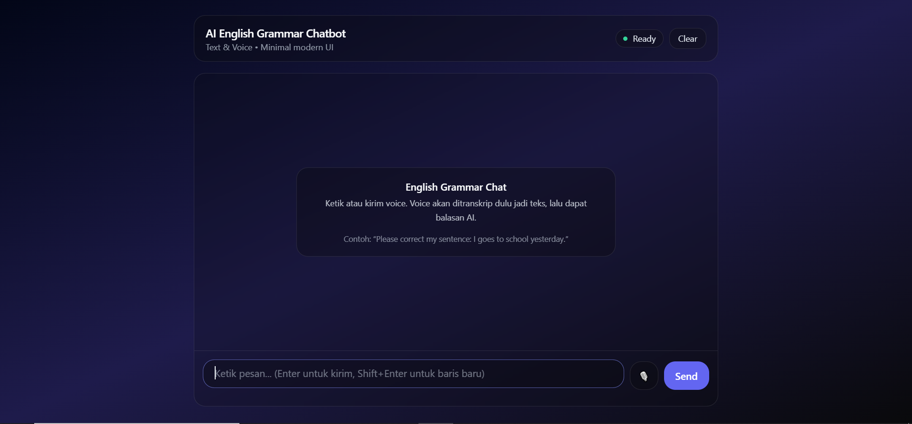
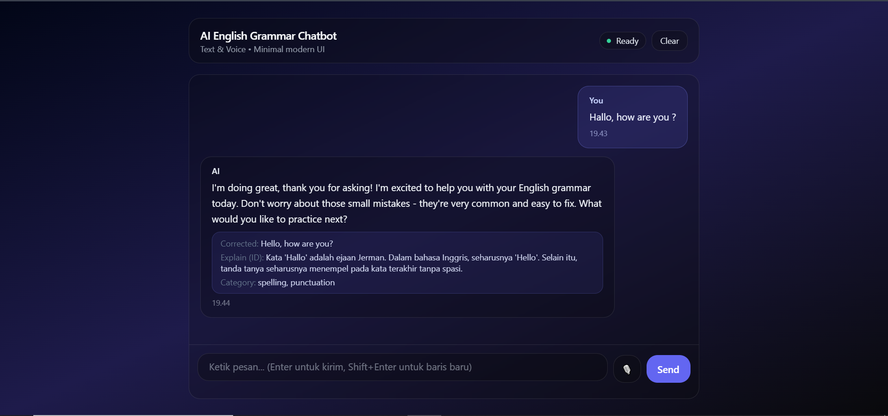
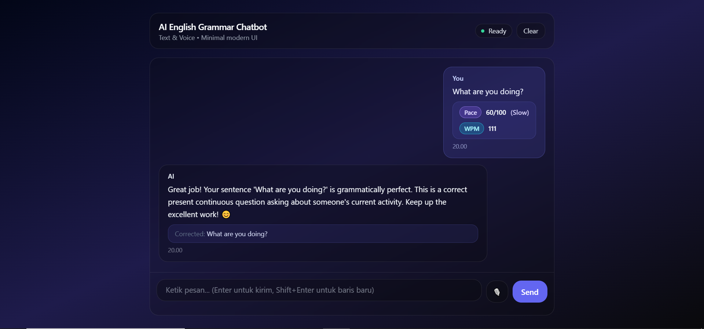

# AI English Grammar Chatbot (Text & Voice)

Aplikasi chatbot untuk membantu latihan Bahasa Inggris: pengguna bisa **chat teks** atau **kirim voice**, lalu sistem akan:

1. (Opsional) mentranskrip audio menjadi teks (STT)
2. melakukan **koreksi grammar** + **penjelasan singkat dalam Bahasa Indonesia**
3. memberi **versi kalimat yang benar** dan melanjutkan percakapan

Backend dibuat dengan **FastAPI**, frontend berupa halaman statis (HTML + Tailwind + JS) yang bisa disajikan langsung oleh backend.

## Preview UI







## Fitur

- Chat teks untuk koreksi grammar + balasan percakapan
- Voice input:
	- endpoint chat voice (audio → transkrip → pipeline chat)
	- endpoint transcribe + skor “pace/fluency” sederhana berbasis WPM
- Riwayat pesan disimpan ke SQLite (per `session_id`)
- Frontend minimal modern UI, dapat diakses dari endpoint root (`/`)

## Tech Stack

- Backend: FastAPI, Uvicorn
- LLM: OpenRouter (`OR_API_KEY`, `OR_MODEL_NAME`)
- Database: SQLite (SQLAlchemy)
- Speech-to-Text: `faster-whisper` (membutuhkan `ffmpeg`)
- Frontend: HTML + Tailwind CDN + Vanilla JS

## Arsitektur Singkat

- Frontend mengirim request ke API FastAPI:
	- `POST /chat` untuk teks
	- `POST /voice` untuk voice chat (multipart audio)
	- `POST /voice/transcribe` untuk transkripsi + skor pace
- Backend:
	- menyimpan pesan user dan AI ke SQLite
	- membangun prompt tutor grammar
	- memanggil LLM via OpenRouter
	- untuk voice: menyimpan audio ke `storage/audio/` lalu transcribe

## Endpoint API

Base URL default: `http://localhost:8000`

- `GET /` — UI frontend (jika folder `frontend/` tersedia)
- `GET /docs` — Swagger UI

### 1) Chat teks

`POST /chat`

Body JSON:

```json
{
	"session_id": "sess_xxx",
	"user_input": "I goes to school yesterday"
}
```

Response (contoh struktur):

```json
{
	"has_error": true,
	"error_categories": ["Subject-verb agreement", "Tense"],
	"explanation": "... (Bahasa Indonesia)",
	"corrected_sentence": "I went to school yesterday.",
	"chat_reply": "..."
}
```

Contoh cURL:

```bash
curl -X POST http://localhost:8000/chat \
	-H "Content-Type: application/json" \
	-d "{\"session_id\":\"sess_demo\",\"user_input\":\"I goes to school yesterday\"}"
```

### 2) Voice chat (audio → transkrip → chat)

`POST /voice`

Form-data:
- `session_id` (string)
- `audio_file` (file)

Contoh cURL:

```bash
curl -X POST "http://localhost:8000/voice?session_id=sess_demo" \
	-F "audio_file=@./sample.webm"
```

### 3) Transcribe + skor pace

`POST /voice/transcribe`

Form-data:
- `audio_file` (file)
- `duration_ms` (opsional, integer)

Contoh cURL:

```bash
curl -X POST http://localhost:8000/voice/transcribe \
	-F "audio_file=@./sample.webm" \
	-F "duration_ms=5000"
```

## Struktur Folder

```text
backend/
	app/
		main.py              # FastAPI app + mount frontend
		routes/              # /chat dan /voice
		services/            # OpenRouter, STT (whisper), fluency scoring
		database/            # SQLAlchemy models + SQLite engine
	requirements.txt
frontend/
	index.html
	app.js
documentation/
	*.png                  # gambar README
storage/
	audio/                 # output upload audio (runtime)
```

## Menjalankan Secara Lokal (Tanpa Docker)

### Prasyarat

- Python 3.11+
- `ffmpeg` terpasang dan ada di PATH (dibutuhkan untuk proses audio)
- API key OpenRouter

### 1) Setup environment variables

Buat file `backend/.env`:

```env
OR_API_KEY=YOUR_OPENROUTER_KEY
OR_MODEL_NAME=YOUR_MODEL_NAME
```

Contoh `OR_MODEL_NAME` tergantung model yang kamu pilih di OpenRouter.

### 2) Install dependencies & run

```bash
cd backend
python -m venv .venv
source .venv/Scripts/activate
pip install -r requirements.txt
uvicorn app.main:app --reload --host 0.0.0.0 --port 8000
```

Buka:

- UI: `http://localhost:8000/`
- API docs: `http://localhost:8000/docs`

## Menjalankan dengan Docker

Repository ini punya 2 Dockerfile:

- `Dockerfile` (root): build **backend + frontend** (rekomendasi untuk demo)
- `backend/Dockerfile`: build **backend saja** (tanpa bundle frontend)

### Build & run (root Dockerfile)

```bash
docker build -t ai-english-chatbot .
docker run --rm -p 8000:8000 \
	-e OR_API_KEY=YOUR_OPENROUTER_KEY \
	-e OR_MODEL_NAME=YOUR_MODEL_NAME \
	ai-english-chatbot
```

Lalu akses `http://localhost:8000/`.

## Catatan

- SQLite tersimpan di `storage/chat.db` (lokasi relatif terhadap working directory saat aplikasi dijalankan).
- Upload audio tersimpan di `storage/audio/`.

